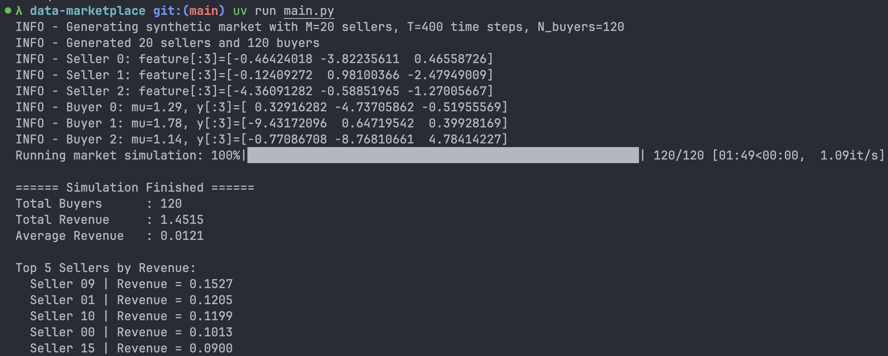

## 核心算法介绍

### 特征分配函数 $\mathcal{AF^*}$

特征分配函数根据市场价格 $p_n$ 和买家出价 $b_n$ 决定数据质量。当出价低于市场价格时，特征会加入噪声：

$$
\tilde{X}_j(t) = X_j(t) + \max(0, p_n - b_n) \cdot \mathcal{N}(0, \sigma^2)
$$

其中噪声大小由价格差决定，标准差由 $\sigma$ 控制。这部分代码实现如下：

```python
def allocate_features(
    X: NDArray[np.float64],
    p: float,
    bid: float,
    sigma: float = 1.0,
    rng: np.random.Generator | None = None,
) -> NDArray[np.float64]:
    noise_scale = max(0.0, p - bid)
    if noise_scale == 0.0:
        return X.copy()
    noise = rng.normal(loc=0.0, scale=sigma * noise_scale, size=X.shape)
    return X + noise
```

---

### 收入函数 $\mathcal{RF^*}$

收入函数的核心是根据买家的出价和市场设定的价格来计算收入。通过 Myerson 的支付规则，我们可以得到如下收入公式：

$$
RF^*(p_n, b_n, Y_n) = b_n \cdot G(Y_n, \hat{Y}_n) - \int_0^{b_n} G(Y_n, \hat{Y}_z) \, dz
$$

其中，$G(Y_n, \hat{Y}_n)$ 表示增益函数，衡量预测结果和目标值之间的差距，$\hat{Y}_n$ 是模型在买家数据上预测的结果，而积分部分表示了买家在不同出价下的增益。

在代码实现中，`revenue_function` 计算了 Myerson 支付规则下的收入。首先计算了实际增益 $G(Y_n, \hat{Y}_n)$，然后通过数值积分计算总收入：

```python
def revenue_function(
    p: float,
    bid: float,
    y_true: NDArray[np.float64],
    model: MLModel,
    X_alloc_func: Callable[[float], NDArray[np.float64]],
    integral_grid: int = 15,
) -> tuple[float, float]:
    Xb = X_alloc_func(bid)
    y_test, y_test_hat = model.fit_predict(Xb, y_true)
    g_bid = gain(y_test, y_test_hat)
    
    zs = np.linspace(0.0, bid, integral_grid)
    gs = [gain(model.fit_predict(X_alloc_func(z))[0], model.fit_predict(X_alloc_func(z))[1]) for z in zs]
    integral = float(np.trapezoid(gs, zs))
    
    rev = bid * g_bid - integral
    rev = max(0.0, rev)  # Ensure non-negative revenue
    return rev, g_bid
```

该函数首先计算实际增益 `g_bid`，然后通过数值积分计算在不同出价下的增益。最后，使用 Myerson 支付规则计算并返回实际收入。收入计算的准确性和效率是实现该市场机制的关键。

---

### 价格更新函数 $\mathcal{PF^*}$（Algorithm 1）

根据每个候选价格的收益，市场动态地调整价格以最大化总收入。具体来说，使用 MWU 来实现这一目标：

$$
w_i^{(n+1)} = w_i^{(n)} \cdot (1 + \delta \cdot g_i^{(n)})
$$

其中，$g_i^{(n)}$ 是每个候选价格的收益，$\delta$ 是更新步长。

`MWUPricer` 类实现了这一更新规则。通过计算每个候选价格的收益，并根据这些收益更新价格权重：

```python
class MWUPricer:
    def __init__(self, b_min, b_max, N, L_lipschitz=1.0, rng=None):
        self.rng = rng or np.random.default_rng()
        self.eps = 1.0 / (L_lipschitz * np.sqrt(max(N, 1)))  # epsilon-net granularity
        self.grid = np.arange(b_min, b_max + 1e-9, self.eps, dtype=np.float64)
        self.num_exp = len(self.grid)
        self.delta = np.sqrt(np.log(self.num_exp) / max(N, 1))
        self.weights = np.ones(self.num_exp, dtype=np.float64)  # Initialise weights

    def update(self, gains: NDArray[np.float64]):
        self.weights *= 1.0 + self.delta * gains
```

每次更新时，权重通过`update`方法进行调整。通过这种方式，市场能够根据收益动态调整价格，以达到最佳的市场均衡。

---

### Shapley 分配 $\mathcal{PD}^*_A$（Algorithm 2）

Shapley 值是用来公平分配收入的一种方法，衡量每个卖家在市场中所做的贡献。我们使用蒙特卡罗方法来近似计算 Shapley 值：

$$
\psi^{\text{shapley}}(m) = \sum_{T \subseteq [M] \setminus \{m\}} \frac{|T|!(M - |T| - 1)!}{M!} \left(G(Y_n, \mathcal{M}(X_{T \cup m})) - G(Y_n, \mathcal{M}(X_T))\right)
$$

代码中的 `shapley_approx` 函数通过计算每个卖家的边际贡献来近似 Shapley 值：

```python
def shapley_approx(
    y_true: NDArray[np.float64],
    X: NDArray[np.float64],
    model: MLModel,
    num_samples: int = 200,
    rng: np.random.Generator | None = None,
) -> NDArray[np.float64]:
    contrib = np.zeros(X.shape[0])
    for _ in range(num_samples):
        perm = rng.permutation(X.shape[0])
        prefix_indices = tuple()
        for j in perm:
            contrib[j] += marginal_gain(prefix_indices, j)
            prefix_indices += (j,)
    contrib /= num_samples
    total = contrib.sum()
    if total > 0:
        contrib /= total  # Normalize to sum to 1
    return contrib
```

通过反复随机排列特征并计算每个特征的边际贡献，最终得到每个卖家贡献的 Shapley 值。

### 鲁棒 Shapley 分配 $\mathcal{PD}^*_B$（Algorithm 3）

为了避免特征冗余问题，论文提出了一种鲁棒化的 Shapley 分配方法，通过计算特征之间的余弦相似度，对冗余特征进行惩罚。具体公式如下：

$$
\psi_n(m) = \hat{\psi}_n(m) \cdot \exp\left(-\lambda \sum_{j \neq m} SM(X_m, X_j)\right)
$$

在代码中，`robustify_shapley` 函数实现了这一过程。它计算特征之间的余弦相似度，并对特征的 Shapley 值进行惩罚：

```python
def robustify_shapley(psi: NDArray[np.float64], X: NDArray[np.float64], lam: float = np.log(2.0)) -> NDArray[np.float64]:
    sim = np.abs(X @ X.T)  # Cosine similarity
    penalty = np.exp(-lam * (sim.sum(axis=1) - 1.0))  # Exclude self-similarity
    return psi * penalty / penalty.sum()
```

这样，市场可以对相似特征进行适当的惩罚，避免冗余特征导致的收入不公平。

## 实验结果与分析

运行结果如下：



在本次实验中，我们生成了一个包含 20 个卖家和 120 个买家的市场。卖家的特征是通过与潜在因子相结合生成的，每个买家的目标向量则是基于部分卖家的特征，且买家有自己的私人估值 $\mu$。买家在市场中根据其私人估值和市场价格 $p_n$ 选择合适的出价，卖家根据市场价格提供相应的特征。

### 收入分析

```
Total Buyers      : 120
Total Revenue     : 1.4515
Average Revenue   : 0.0121
```

模拟运行的结果显示市场总收入为 1.4515，平均每个买家的收入为 0.0121。这个结果表明，在模拟中，市场成功产生了正向收益，即买卖双方都能从交易中受益。

### 卖家收入分布

卖家的收入呈现出不均匀分布，部分卖家因提供更有价值的特征而获得更高的收入。前五名卖家的收入分别为：

```
Top 5 Sellers by Revenue:
  Seller 09 | Revenue = 0.1527
  Seller 01 | Revenue = 0.1205
  Seller 10 | Revenue = 0.1199
  Seller 00 | Revenue = 0.1013
  Seller 15 | Revenue = 0.0900
```

这表明市场机制通过公平分配机制保证了大部分卖家根据贡献获得了相应的收入。